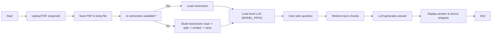

# Flowchart — Simplified App Flow

**Short explanation**

1. **Upload PDF** — User uploads a PDF via the Streamlit UI.
2. **Save temp file** — The file is saved to a temporary path so loaders can read it.
3. **Vectorstore** — If a Chroma vectorstore already exists for the uploaded file it is loaded; otherwise the app builds one by splitting text and embedding chunks.
4. **LLM Load** — The local LLM is loaded from `MODEL_PATH`.
5. **QA Loop** — User asks a question, the retriever fetches most relevant chunks, the LLM answers, and the UI displays the answer and source snippets.
